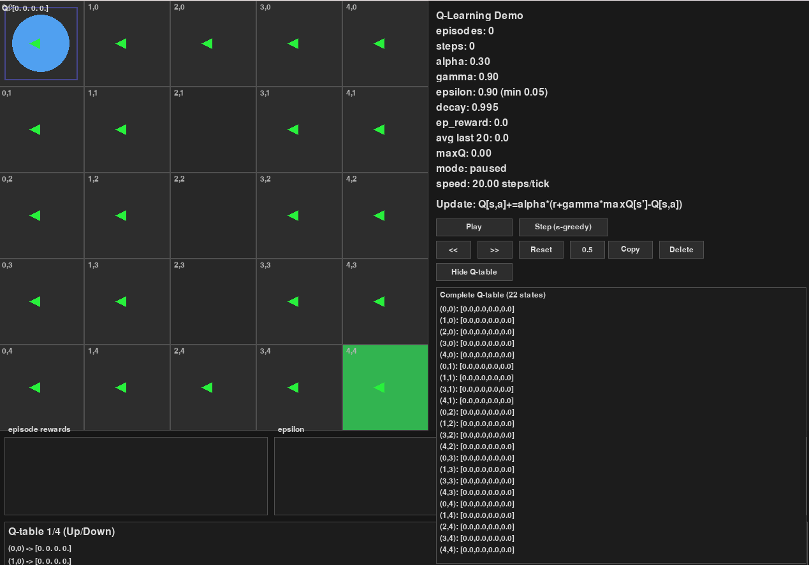
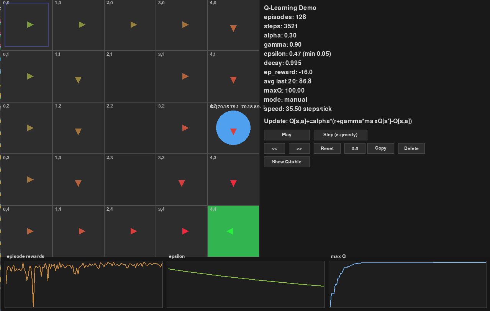
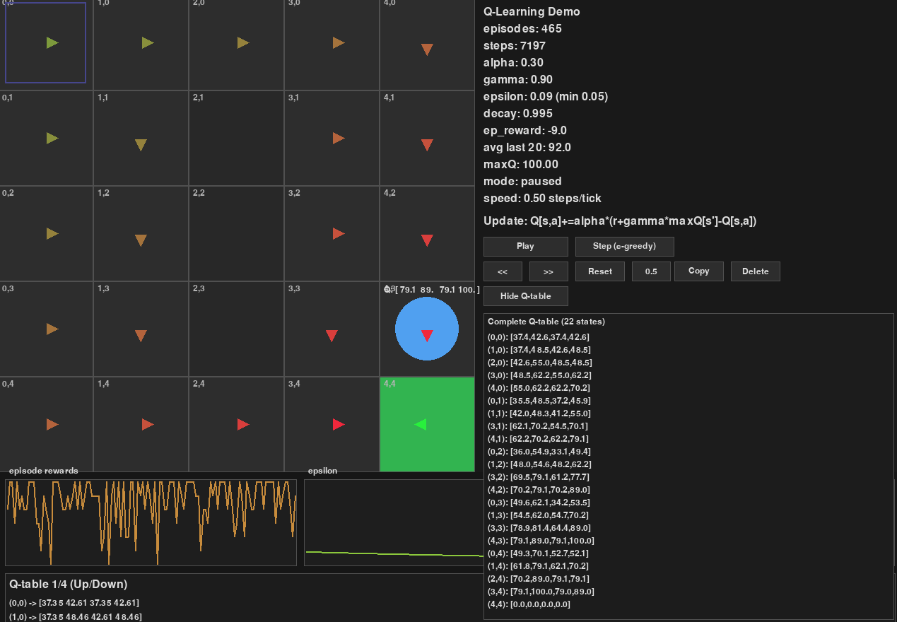

# Q-Learning Gridworld (Pygame)

An educational Q-learning demo in a simple gridworld rendered with Pygame. It displays parameters (alpha, gamma, epsilon), episode stats, the update equation, and a Q-value overlay.


*Initial state: Agent at (0,0), all Q-values are zero, and exploration is high (epsilon=0.90).*


*Mid-training: Agent has learned some optimal paths (arrows point toward goal), Q-values have increased, and epsilon has decayed to 0.09.*


*Advanced learning: The agent's policy is nearly optimal. The reward graph shows learning progress, and the max Q-value plot indicates convergence.*

---

## Controls

- **Space**: Start/pause training
- **Q**: Toggle Q-value overlay
- **R**: Reset everything (Q-table, epsilon, episodes)
- **C**: Clear Q-table only
- **D**: Toggle epsilon decay
- **1/2**: Adjust alpha ±0.05
- **3/4**: Adjust gamma ±0.05
- **5/6**: Adjust epsilon ±0.05
- **N**: Run one episode immediately

---

## Install & Run

```bash
pip install -r requirements.txt
python main.py